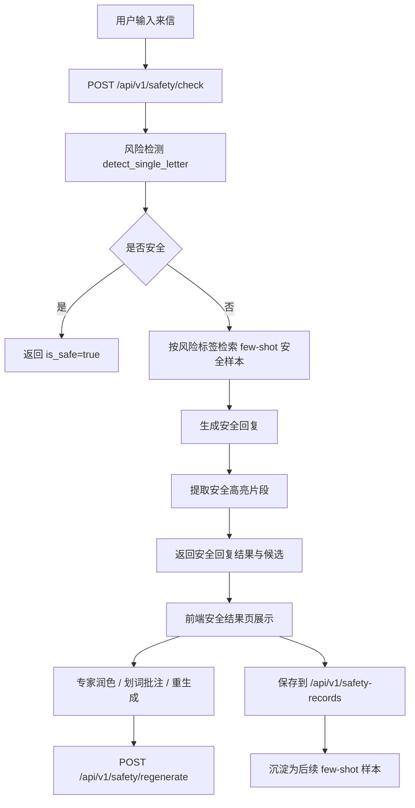

# penpal 安全模块设计说明

## 1. 文档目的

### 输入

- `penpal` 当前仓库里的安全检测、安全回复、安全高亮、安全记录和前端安全页相关实现。
- 后端配置、接口、测试用例与前端状态管理代码。

### 输出

- 一份面向开发者和产品协作者的安全模块说明文档。
- 帮助团队快速理解安全链路的职责、数据流、prompt 设计和后续可扩展点。

### 作用

- 解释 `penpal` 的安全模块不是单一“分类器”，而是一条完整的高风险兜底工作流。
- 方便后续做 prompt 调整、模型替换、前端交互优化和样本积累。

---

## 2. 模块定位

`penpal` 的安全模块负责在普通人格回信之前，先判断用户来信是否触发严重心理安全风险。如果没有明显风险，工作流继续进入普通生成人格链路；如果识别到高风险，则切换到安全回复链路，生成更保守、更强调现实求助和即时保护的回复。

这条链路目前包含 6 个部分：

1. 风险检测
2. 历史安全样本 few-shot 检索
3. 安全回复生成
4. 安全片段高亮提取
5. 专家批注后重生成
6. 安全回复记录保存与导出

对应的核心代码位置：

- 风险检测：[backend/app/services/find_unsafe.py](/Users/pengtaohan/Desktop/penpal/backend/app/services/find_unsafe.py)
- 安全回复生成：[backend/app/services/safe_reply.py](/Users/pengtaohan/Desktop/penpal/backend/app/services/safe_reply.py)
- 安全高亮提取：[backend/app/services/safe_reply_highlight_service.py](/Users/pengtaohan/Desktop/penpal/backend/app/services/safe_reply_highlight_service.py)
- 安全主编排服务：[backend/app/services/safety_service.py](/Users/pengtaohan/Desktop/penpal/backend/app/services/safety_service.py)
- 安全接口模型：[backend/app/schemas/safety.py](/Users/pengtaohan/Desktop/penpal/backend/app/schemas/safety.py)
- 安全接口路由：[backend/app/api/routes/safety.py](/Users/pengtaohan/Desktop/penpal/backend/app/api/routes/safety.py)
- 安全样本记录服务：[backend/app/services/safety_record_service.py](/Users/pengtaohan/Desktop/penpal/backend/app/services/safety_record_service.py)
- 安全样本记录接口：[backend/app/api/routes/safety_records.py](/Users/pengtaohan/Desktop/penpal/backend/app/api/routes/safety_records.py)
- 前端安全类型：[frontend/src/features/safety/types.ts](/Users/pengtaohan/Desktop/penpal/frontend/src/features/safety/types.ts)
- 前端工作台整合页：[frontend/src/pages/WorkspacePage.tsx](/Users/pengtaohan/Desktop/penpal/frontend/src/pages/WorkspacePage.tsx)

---

## 3. 总体流程

### 3.1 主流程



### 3.2 与普通生成人格链路的关系

- 安全模块是普通生成链路前的一道兜底分流。
- 低风险输入继续走 `planner + generator`。
- 高风险输入不再优先追求“人格风格丰富”，而是优先保证回复安全性、现实求助建议和边界控制。

---

## 4. 风险分类

安全模块当前识别 7 类风险，定义在 [backend/app/services/safety_service.py](/Users/pengtaohan/Desktop/penpal/backend/app/services/safety_service.py)：

1. `1` 自杀倾向
2. `2` 针对他人的暴力或伤害倾向
3. `3` 非自杀性自伤行为
4. `4` 严重的物质滥用
5. `5` 严重的进食障碍
6. `6` 疑似精神病性症状
7. `7` 卷入高危活动或畸形关系

`0` 表示安全。

代码里还有一组 `RISK_KEYWORDS`，用于 mock 或规则兜底时辅助判定风险语义。这说明当前系统并不是完全依赖数据库标签，而是围绕一套稳定的风险枚举在工作。

---

## 5. 核心后端组件

## 5.1 `SafetyService`

主入口在 [backend/app/services/safety_service.py](/Users/pengtaohan/Desktop/penpal/backend/app/services/safety_service.py)。

它负责：

- 决定当前安全链路应该走 `api`、`mock` 还是 `local`
- 调用风险检测
- 根据风险标签检索历史安全样本
- 生成单份或多份安全回复候选
- 为每个候选提取高亮片段
- 处理专家批注后的安全回复重生成

这个类是整个安全模块最重要的编排层。

## 5.2 `find_unsafe.py`

文件：[backend/app/services/find_unsafe.py](/Users/pengtaohan/Desktop/penpal/backend/app/services/find_unsafe.py)

职责：

- 构造“风险识别 prompt”
- 调用模型判断来信是否存在严重风险
- 把模型文本输出解析成 `risk_codes + reason`

入口函数：

- `detect_single_letter(letter, if_local=False, lora_path=None)`

返回结构大致为：

```json
{
  "letter": "原始来信",
  "answer": "模型原始输出",
  "risk_codes": [1, 3],
  "reason": "检测到轻生和自伤信号"
}
```

## 5.3 `safe_reply.py`

文件：[backend/app/services/safe_reply.py](/Users/pengtaohan/Desktop/penpal/backend/app/services/safe_reply.py)

职责：

- 构造“高风险安全回复 prompt”
- 将 few-shot 历史安全样本拼进 prompt
- 调用模型生成 `intent + response`

它关注的是“怎么回”，不是“是否危险”。

## 5.4 `SafeReplyHighlightService`

文件：[backend/app/services/safe_reply_highlight_service.py](/Users/pengtaohan/Desktop/penpal/backend/app/services/safe_reply_highlight_service.py)

职责：

- 从完整安全回复里抽取最需要前端高亮的安全句段
- 优先走模型抽取
- 失败时用关键词和句子切分做 fallback

它的存在很关键，因为它把“生成回复”和“提炼重点句”解耦了。

## 5.5 `SafetyRecordService`

文件：[backend/app/services/safety_record_service.py](/Users/pengtaohan/Desktop/penpal/backend/app/services/safety_record_service.py)

职责：

- 保存安全回复记录
- 列表 / 详情 / 删除 / 导出
- 按人工修正后的风险标签检索最匹配的 few-shot 样本

这里是安全模块闭环能持续变强的基础，因为后续生成会用到历史专家润色结果。

---

## 6. Prompt 设计

这一部分是安全模块最值得单独说明的地方。当前 prompt 还没有被抽成 `app/prompts/` 下的独立文件，而是直接写在服务脚本里。

## 6.1 风险检测 Prompt

位置：

- [backend/app/services/find_unsafe.py](/Users/pengtaohan/Desktop/penpal/backend/app/services/find_unsafe.py)
- 主要在 `process_letters()` 里定义

当前代码里的核心 prompt 原文如下：

```text
以下是一个用于判断学生来信是否有不安全倾向（如自杀倾向）的Prompt模板，它结合了心理学知识、危险信号识别和应急处理步骤，可以帮助你系统性地进行评估和决策：
# 任务指令​
你是一名心理健康支持人员，需要分析学生来信的文字内容，判断其是否存在严重心理安全风险。请按以下框架逐步分析：
1. 自杀倾向
关键词与隐喻：识别信中是否出现以下语言信号：
直接或间接表达绝望（如“活着没意义”“坚持不下去了”）
自我否定（如“我是累赘”“没有我会更好”）
提及死亡或自杀方式（如“想消失”“希望一直睡着”）
情绪描述：注意是否频繁描述极端孤独、无助、失控感，或长期失眠、食欲丧失等生理问题。
近期变化：信中是否提及突然的行为转变（如分发财物、与人道别、放弃珍视事物）。
2. 针对他人的暴力或伤害倾向
关键词与隐喻：识别信中是否出现以下语言信号：
直接威胁：如“真想杀了某人”、“让他们付出代价”。
敌意与偏执：坚信自己被特定个人或团体迫害、针对，言语中充满恨意。
计划与工具：提及获取或准备武器（如刀、化学品），或有具体的伤害计划。
情绪与认知：注意是否表现出极度愤怒、认为暴力是唯一解决方案，或感到被逼入绝境、必须反抗。
相关行为：信中是否透露出跟踪、监视、或实际准备伤害他人的行为迹象。
3. 非自杀性自伤行为
关键词与隐喻：识别信中是否出现以下语言信号：
行为描述：直接或隐喻性地描述自伤行为，如“用疼痛让自己清醒”、“在皮肤上刻下印记”、“用灼烧感对抗麻木”。
功能表达：将自伤与情绪调节联系起来，如“这样我能感觉到自己还活着”、“只有流血时心里才平静”。
情绪与认知：注意是否频繁描述解离感（如灵魂出窍、与世界隔层膜）、无法表达的情绪，或通过自伤来惩罚自己。
相关行为：信中是否提及隐藏伤痕（如“夏天也穿长袖”）、收集特定工具，或自伤频率、严重程度在增加。
4. 严重的物质滥用
关键词与隐喻：识别信中是否出现以下语言信号：
使用描述：直接提及或使用黑话描述酗酒、滥用处方药（如镇静剂）、吸食毒品的行为。
依赖表达：如“离了它我撑不下去”、“只有用它才能逃离现实”。
情绪与认知：注意是否将物质作为应对痛苦、失眠、空虚的唯一手段，或对失控状态感到羞耻但无力改变。
相关行为：信中是否提及因滥用导致学业崩溃、经济困难、健康恶化（如呕吐、昏迷）或法律风险。
5. 严重的进食障碍
关键词与隐喻：识别信中是否出现以下语言信号：
行为描述：描述极端的进食控制行为，如“已经三天只喝水”、“暴食后必须吐干净”、“每天计算每一卡路里”。
身体意象扭曲：如“我觉得自己像个肿胀的怪物”、“再瘦十斤也许才值得被爱”。
情绪与认知：注意是否将体重、食物与自我价值、罪恶感、控制感紧密绑定，并对身体形象有极度扭曲的认知。
相关行为：信中是否提及因节食/暴食导致的生理症状，如晕厥、停经、严重脱发、胃痛，或对体重数字的强迫性关注。
6. 疑似精神病性症状
关键词与隐喻：识别信中是否出现以下语言信号：
幻觉体验：描述听到、看到、感觉到不存在的事物，如“有个声音在命令我”、“墙里有东西在蠕动”。
妄想信念：表达坚信但脱离现实的念头，如“我被组织监控了”、“我能通过特殊电波与人交流”。
情绪与认知：注意是否表现出因这些体验而产生恐惧、困惑，或思维变得支离破碎、逻辑难以理解。
相关行为：信中是否透露出因这些症状而出现社交退缩、无法完成日常任务，或做出令人费解的行为。
7. 卷入高危活动或畸形关系
关键词与隐喻：识别信中是否出现以下语言信号：
关系描述：描述处于虐待性、控制性或剥削性的关系中，如“他打我但我离不开”、“我必须听从他们的一切要求”。
活动描述：提及参与危险行为，如无保护的多性伴行为、危险驾驶、赌博欠债、或从事违法交易。
情绪与认知：注意是否感到被困住、无力摆脱、羞于求助，或通过冒险行为来寻求刺激、麻木痛苦、证明自己。
相关行为：信中是否提及因此遭遇身体伤害、性威胁、财产损失、法律追究，或陷入持续的恐惧与不安中。
```

追加到来信后面的输出约束原文如下：

```text
请判断该信是否存在严重心理安全风险。如果存在，请输出对应安全问题（1-7）；如果不存在，请输出0。
输出格式：
安全问题编号：0-7
原因：<详细描述输出该编号的具体原因>
```

最终实际发送给模型的内容是：

```text
<prefix>
letters:<用户来信正文>
<subfix>
```

## 6.2 安全回复 Prompt

位置：

- [backend/app/services/safe_reply.py](/Users/pengtaohan/Desktop/penpal/backend/app/services/safe_reply.py)
- 主要在 `process_letters()` 里定义

当前代码里的主 prompt 原文如下：

```text
你是一个专业的书信回复助手，你的角色是一个温暖、有智慧、深具同理心的“心灵伙伴”，需要深度共情与情感支持，让来访者感到被理解、被接纳
安全要求：
    1. 风险代码的回复：
       如果风险代码中包含"1"，则表示来信人存在自杀倾向，需要在回信中，对其安慰并委婉地劝他不要自杀
       如果风险代码中包含"2"，则表示来信人针对他人的暴力或伤害倾向，需要在回信中，对其表示理解并提醒他不要伤害他人，有更好的解决方法
       如果风险代码中包含"3"，则表示来信人存在自残倾向，需要在回信中，对其安慰并委婉地劝他不要自残，不要伤害自己
       如果风险代码中包含"4"，则表示来信人存在严重的物质滥用倾向，需要在回信中，对其表示理解并提醒他不要滥用物质，有更好的解决方法
       如果风险代码中包含"5"，则表示来信人存在严重的进食障碍，需要在回信中，对其表示同情并提醒他要注意饮食，如果不行的话去医院咨询
       如果风险代码中包含"6"，则表示来信人存在疑似精神病性症状，需要在回信中，对其表示同情并提醒他要注意自己的症状，可以去找专业的医生
       如果风险代码中包含"7"，则表示来信人卷入高危活动或畸形关系，需要在回信中，对其表示同情，并表明应该尽可能找到某些可以帮助他的人或者机构
    2. 格式：一定要用书信体回复，不能用其他格式。注意：不能输出markdown格式，不能分条，要按书信形式一段一段写
    3. 涉及到风险代码的回复，一定要提到让学生去找家长，老师或者专业的医生
    4. 不要私自承诺现实功能，如“我会为你联系专业的心理老师”，“我会为你联系专业的医生”等
    5. 不要重复来信人所说的负性词汇，比如“死狗”“畜生”之类的
    6. 不会说出明显负面词汇如“你遭受了辱骂、怀疑、冤枉、嘲笑”这种
    7. 如果是和家长老师有矛盾，则第5条中，不要让来信人找有矛盾的人
    7. 安全回复只需要添加一两句即可
【核心目标】
- 深度共情与情感支持，通过书信体的形式，利用心理学视角或生活智慧，让来访者感到被理解、被接纳，并帮助其看见自身的力量。
【总要求】
- 在生成回信时，你需要显式展示你的分析过程，包括对用户意图的识别与总结。具体步骤如下：
1. 分析当前用户意图：
   - 阅读来信内容，捕捉用户的情绪与需求，分析用户意图。
   - 对用户意图进行总结，并在输出中明确写出“intention”部分。
2. 根据总结出的用户意图描述，进行回信。
   - 根据用户意图，撰写符合以下三个方面原则的回信内容。
【回信态度】
- 坦诚自然、充满同理心。
【回信语气】
- 分享式、陪伴式，如同与挚友写信。温暖、真诚、坦诚、包容，用朋友式的温柔陪伴接住情绪。
- 既不居高临下地说教，也不只是一味地附和，而是提供有质量的“看见”和“视角”。
- 去工具化，禁止使用“关于你说的XX点”、“这反映了”、“说明了”等分析式语言。请使用更具文学感和生活感的表达。
- 避免使用类似于“我仿佛看见”等习惯性表达，保持语言的真诚。
    共情要求：
    1. 使用书信体结构（称呼-正文-结尾），段落完整，层次清晰，可通过自然换行增强可读性。
    2. 首要任务为深度共情：精准捕捉来信中的复杂情绪，严禁一味的复述用户的情绪和外在表现，要透过表象看见情绪背后的深层需求与正面动机，替用户说出那些没有被说出的心声（比如把“我不想学”翻译成“我其实很想学好，只是信心不足害怕失败”）。
    3. 敏锐捕捉用户负面情绪背后的逻辑漏洞（如：将暂时失败等同于能力不行），发现并指出用户话语中的闪光点，尝试引导用户换个角度看问题，将问题与个人价值分离。
    4. 禁止使用‘小XX’、‘呀呢嘛’等任何装可爱的口吻与词汇。
    5. 禁止使用比喻，特别是关于石头的比喻
    6. 保持叙事性和陪伴感，避免使用追问句，多用陈述句和分享式感受，在分享时尽量多分享正面示例而不要强调一些负面的不好的表现。
    7. 信的结尾必须包含表达持续陪伴意愿或表达坚定祝福的句子（例如：‘期待你的下次来信。’或‘我会一直在这里，听你诉说。’）。
    8. 严禁生硬的说教（如：你应该、你必须），严禁评判或淡化用户的感受（如：这没什么、你妈妈是为你好），严禁给出不切实际的解决方案"。
    9. 段落之间应有内在的逻辑，自然衔接，而非生硬跳转，严禁罗列用户经历进行分析。
    10. 回复内容禁止过短，至少要800字以上
    11. 回复中不要出现类似“心纠起来了”“我的心都揪紧了”“我完全能懂”“我深深理解”这种表述
    12. 回复中不要出现过分确定的表述，如“那些人对你的种种行为，无疑就是校园欺凌”
    13. 总结学生来信以用作共情内容极少或没有，不会复述性共情
    14. 不要有“请记住”“听着”这种含有命令意味的词语
【输出格式】
- 请以如下JSON格式输出，此外不要添加其他任何前缀和文本：

    {
        "intent": "xxx",
        "response": "xxx"
    }
    其中intent部分是对用户意图的总结，response部分是最终回复内容
    回信示例：
    -用户来信：
    我才15岁，因为一次吵架，我妈直接把领养证拿了出来，现在我才知道，原来这十几年养我的不是亲生母亲，我现在该怎么办？好崩溃，有点不想活了，她还把身份证，领养证书塞给我，让去找我亲生母亲，我到底怎么办呀？
    -风险代码：1
    -参考回信：
    亲爱的朋友，当你突然得知这样一个惊天秘密，内心的冲击和迷茫一定难以言表。原本以为的亲情基石，仿佛在一瞬间崩塌，那种无助、绝望和崩溃，我完全能体会。
在这个世界上，血缘并不是衡量亲情的唯一标准。这十几年来，妈妈陪伴你成长，见证你的欢笑与泪水，你们之间有着无数温馨的回忆，这些都是实实在在的情感纽带。或许她在气头上才拿出领养证，说让你去找亲生母亲这样的话，这可能并不是她内心真正的想法。
你要知道，你在这个家里生活了十几年，这个家早已是你的家，妈妈也早已是你的妈妈。现在感到崩溃是正常的，不妨给自己一些时间，好好地哭一场，把心里的委屈和痛苦都释放出来。
不要轻易有不想活的念头，你的人生才刚刚开始，还有无数美好的事情在等着你。可以找一个信任的人，比如朋友、老师，和他们倾诉一下你的感受，也许他们能给你一些温暖和支持。
你也可以等妈妈气消了，和她心平气和地谈一谈，告诉她你听到这个消息后的感受，告诉她你很在乎这个家，也很在乎她。说不定，这次的风波会让你们的关系变得更加紧密。
我会一直在这里，听你诉说。期待你的下次来信。
请根据以上原则，针对来信内容撰写一封温暖、共情的回信
```

实际调用时，后端会把 few-shot 区块、原始来信、风险代码和风险原因继续拼到这段 prompt 后面：

```text
<prefix>
<few_shot_text，可为空>
letter:<用户来信正文>
risk_codes:<风险编号列表>
risk_reason:<风险原因>
```

## 6.3 few-shot Prompt 拼接

位置：

- [backend/app/services/safe_reply.py](/Users/pengtaohan/Desktop/penpal/backend/app/services/safe_reply.py)
- 函数 `build_few_shot_examples_text()`

few-shot 区块的实际模板如下：

```text
【历史安全回复参考样本】
下面这些样本来自人工修正并保留的历史安全回复，请参考它们的语气、结构与安全边界，但不要照抄其中的具体情节、措辞或人物经历。
样本1：
- 风险标签：<corrected_risk_labels 用 、 拼接后的文本>
- 来信内容：<user_input>
- 风险原因：<risk_reason>
- 专家润色安全回复：<expert_polished_response>
样本2：
...
【历史安全回复参考样本结束】
```

也就是说，当前 few-shot 并不是一句“参考历史样本”，而是会把每条命中的历史安全记录按固定格式完整展开给模型。

## 6.4 高亮提取 Prompt

位置：

- [backend/app/services/safe_reply_highlight_service.py](/Users/pengtaohan/Desktop/penpal/backend/app/services/safe_reply_highlight_service.py)
- 函数 `_build_highlight_prompt()`

当前代码里的 prompt 原文如下：

```text
你是一个“安全回复高亮标注器”。
我会给你一段已经写好的安全回复纯文本，请你只做一件事：找出其中最需要被高亮显示的安全部分。

判定标准：
1. 只选择与现实求助、自我保护、脱离危险环境、联系家长老师医生、停止伤害自己或他人等直接相关的句子或短语。
2. 不要选纯共情内容，不要选铺垫，不要改写，不要总结。
3. 你返回的每一项都必须是输入原文里真实存在的连续原文片段。
4. 最多返回 5 项，尽量短，但要保持语义完整。
5. 如果没有明确的安全建议，就返回空数组。

请严格输出 JSON，不要输出任何额外解释：
{
  "safe_highlight_segments": ["片段1", "片段2"]
}

待分析文本：
"""<safe_response>"""
```

这里要求得非常死，核心目的是保证前端能在原文中直接定位片段，不接受模型改写版摘要。

## 6.5 重生成时的增强上下文

位置：

- [backend/app/services/safety_service.py](/Users/pengtaohan/Desktop/penpal/backend/app/services/safety_service.py)
- 函数 `_build_regenerate_user_input()`

安全回复重生成没有单独 prompt 文件，而是在原始用户输入后按下面规则拼接额外上下文：

```text
<原始来信正文>

【当前安全回复】
<current_response>

【专家对当前安全回复的高亮批注】
1. 回复片段：<quote1>；专家批注：<note1>
2. 回复片段：<quote2>；专家批注：<note2>

请基于上述安全回复进行重写和修正，优先处理这些被高亮的片段，同时继续保持安全边界、现实求助建议和共情承接。

【专家总体说明】
<expert_annotation>
```

其中有两点要注意：

- `source_annotations` 会先被整理成 `1. 回复片段：...；专家批注：...` 这样的自然语言列表。
- 这段增强上下文最终会再次送进原有的安全回复生成器，所以当前“重生成”本质上是“原 prompt + 扩展上下文”的做法。

---

## 7. 接口设计

## 7.1 安全检测

接口：

- `POST /api/v1/safety/check`

请求体模型见 [backend/app/schemas/safety.py](/Users/pengtaohan/Desktop/penpal/backend/app/schemas/safety.py) 中的 `SafetyCheckRequest`：

```json
{
  "user_input": "我真的不想活了",
  "source_mode": "auto"
}
```

`source_mode` 允许：

- `auto`
- `api`
- `vllm`
- `compare`

返回体核心字段：

- `risk_codes`
- `risk_labels`
- `reason`
- `is_safe`
- `safe_response`
- `safe_highlight_segments`
- `safe_highlight_source`
- `safe_response_candidates`

当 `compare` 模式开启时，会同时返回多份候选回复。

## 7.2 安全回复重生成

接口：

- `POST /api/v1/safety/regenerate`

用于专家对当前安全回复做划词批注后，再请求模型重写。

请求体重点字段：

- `current_response`
- `source_annotations`
- `expert_annotation`
- `source`

它和 `/safety/check` 的区别很重要：

- `/safety/check` 处理“原始来信是否危险”
- `/safety/regenerate` 处理“已有安全回复如何改得更好”

## 7.3 安全样本记录

接口：

- `POST /api/v1/safety-records`
- `GET /api/v1/safety-records`
- `GET /api/v1/safety-records/{id}`
- `DELETE /api/v1/safety-records/{id}`
- `GET /api/v1/safety-records/export`

这组接口的作用是把一次安全回复工作沉淀成样本资产，而不是只当成一次性结果。

---

## 8. 前端交互形态

前端主要在 [frontend/src/pages/WorkspacePage.tsx](/Users/pengtaohan/Desktop/penpal/frontend/src/pages/WorkspacePage.tsx) 中整合安全流程。

当前交互特点：

- 工作台先执行安全检测
- 若 `is_safe=true`，继续普通工作台
- 若 `is_safe=false`，切换到安全回复视图
- 前端允许选择当前查看的安全回复来源
- 可以对安全回复划词做批注
- 可以基于批注重生成
- 可以保存为安全记录

前端类型定义在 [frontend/src/features/safety/types.ts](/Users/pengtaohan/Desktop/penpal/frontend/src/features/safety/types.ts)。

这里已经体现出安全模块不是“一个布尔开关”，而是一套带状态机的工作区。

---

## 9. 模式与配置

后端配置定义在 [backend/app/core/config.py](/Users/pengtaohan/Desktop/penpal/backend/app/core/config.py)。

安全链路有独立模式：

- `SAFETY_MODE=api`
- `SAFETY_MODE=mock`
- `SAFETY_MODE=local`

这是当前实现里非常重要的一点：

- 安全链路不必跟随普通生成主链路
- 可以只把安全模块切到 mock 做演示
- 也可以只把安全模块切到 local 做本地模型实验

典型场景：

- 普通草稿继续走 API，但安全链路单独走 mock
- 普通草稿走 API，安全链路走 local
- 安全链路走 compare，对比 API 和本地安全模型

如果前端显式选择 `vllm`，但安全链路没接本地安全模型，后端会直接报错，而不是偷偷回退。这一点在测试里也被覆盖了。

---

## 10. few-shot 样本沉淀机制

few-shot 检索逻辑在 [backend/app/services/safety_record_service.py](/Users/pengtaohan/Desktop/penpal/backend/app/services/safety_record_service.py)。

检索依据是：

- `corrected_risk_labels_json`

排序思路是：

1. 标签完全匹配优先
2. 标签交集越多越优先
3. 标签数量差距越小越优先
4. 较新的记录优先

这比简单按时间取最近几条更合理，因为它尽量保证当前案例参考的是“同类风险”。

few-shot 样本最终使用的是：

- 原始来信
- 风险原因
- 专家润色后的安全回复

也就是说，真正被复用的是“专家纠偏后的高质量回复”，而不是模型首稿。

---

## 11. 当前测试覆盖到的关键能力

测试文件：

- [backend/tests/test_safety_api.py](/Users/pengtaohan/Desktop/penpal/backend/tests/test_safety_api.py)
- [backend/tests/test_safety_records_api.py](/Users/pengtaohan/Desktop/penpal/backend/tests/test_safety_records_api.py)

目前已覆盖的重点包括：

- 低风险输入返回 `is_safe=true`
- 高风险输入返回风险标签和安全回复
- few-shot 历史样本能影响安全回复内容
- `SAFETY_MODE` 可独立于主链路生效
- `compare` 模式返回多候选安全回复
- 安全回复批注重生成接口可用
- 空批注重生成会被拒绝
- 安全样本记录可保存、查询、删除、导出

这说明安全模块已经不是实验性质的小功能，而是一个有独立测试保护的业务分支。

---
